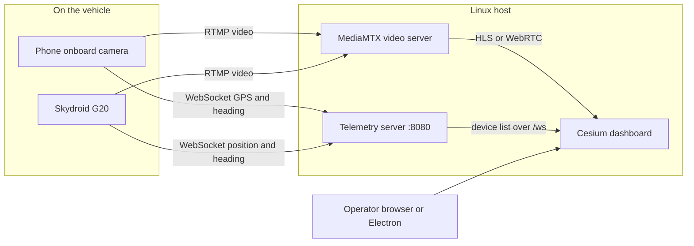
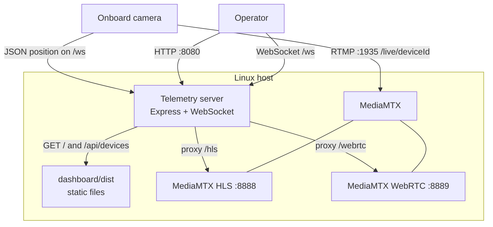
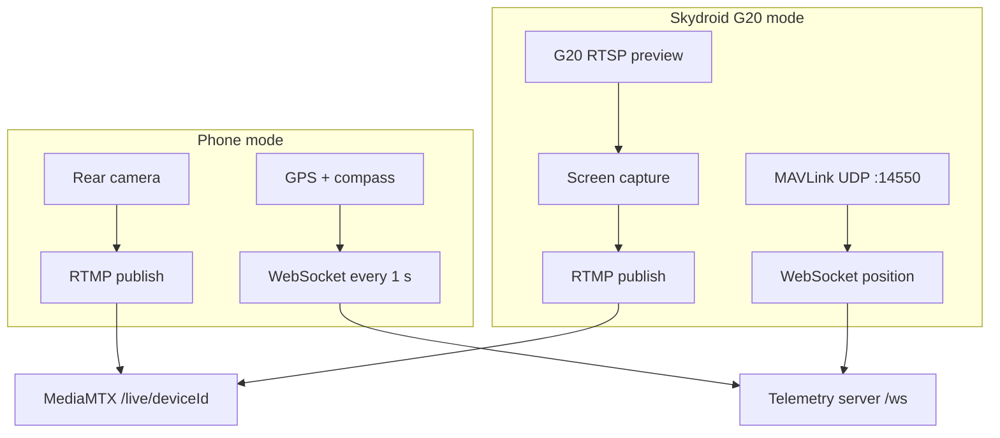
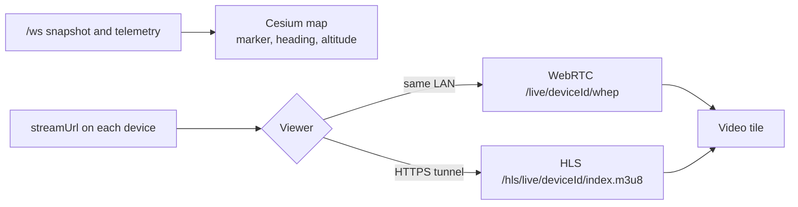
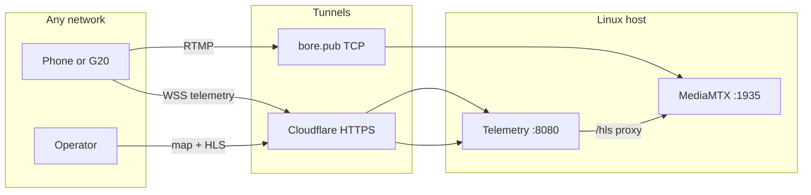

# Situation Awareness Using Onboard Camera

Operators see a live map and the picture from an onboard camera. A phone or a Skydroid G20 publishes video and position to a Linux host. The host runs a telemetry server and a video server. A browser or Electron window shows a Cesium map and the camera.

## How the pieces fit



Video and position travel on separate paths. MediaMTX only carries the camera. The telemetry server only carries position, heading, and which stream to play.

## Server

The Linux host (default `192.168.0.137`) runs two processes. Express also serves the built dashboard and proxies video so a remote operator can use one HTTPS address.



| Port | What it is |
| --- | --- |
| 8080 | Dashboard, REST, and WebSocket telemetry |
| 1935 | RTMP ingest from the onboard camera |
| 8889 | WebRTC playback (WHEP), used on the LAN |
| 8888 | HLS, proxied at `/hls` for viewers off the LAN |
| 8189 | WebRTC ICE (UDP and TCP) |

Health check: `http://192.168.0.137:8080/health`.

A device drops off the map after 15 seconds with no telemetry (`STALE_DEVICE_MS`).

## Onboard camera

Two publishers. Both send the same kind of telemetry: `deviceId`, `lat`, `lng`, `altitude`, `heading`.



Phone mode uses the handset camera. G20 mode pulls the vehicle camera over RTSP, captures that preview, and reads UAV position from MAVLink. Details are in [android/G20_SETUP.md](android/G20_SETUP.md).

## What the operator sees



The dashboard opens a WebSocket, draws each device on the globe, and plays that device's camera. On the LAN it uses WebRTC. Through the Cloudflare link it uses HLS, because that rides the same HTTPS origin.

## Off the local network

`./scripts/start-world.sh` opens two tunnels. Camera ingest and the map do not share one tunnel.



Cloudflare quick-tunnel URLs change every restart. Copy the new World HTTPS URL and World RTMP into the app. See [WORLD_ACCESS.md](WORLD_ACCESS.md).

## Layout

```
infra/          MediaMTX config, docker-compose, systemd units
server/         Express + WebSocket telemetry
dashboard/      React Cesium map + video UI + Electron shell
simulator/      Fake devices for demos
android/        Kotlin publisher for the onboard camera
scripts/        start, stop, deploy, systemd install
```

## Run on the Linux host

Worldwide, real cameras only:

```bash
cd ~/situational-awareness
./scripts/start-world.sh
```

LAN, with the moving-marker simulator:

```bash
./scripts/start-all.sh
```

Stop:

```bash
./scripts/stop-all.sh
```

`start-all.sh` downloads MediaMTX and cloudflared if needed, builds the dashboard, and starts MediaMTX, the telemetry server, and optionally the simulator.

Optional boot units, after the first successful start: `sudo ./scripts/install-systemd.sh` (`sa-mediamtx`, `sa-telemetry`, `sa-simulator`).

| What | Where |
| --- | --- |
| LAN dashboard | `http://192.168.0.137:8080/` |
| WebSocket | `ws://192.168.0.137:8080/ws` |
| RTMP publish | `rtmp://192.168.0.137:1935/live/<deviceId>` |
| WebRTC play | `http://192.168.0.137:8889/live/<deviceId>/whep` |

## Mac preview

```bash
cd dashboard
npm install
npm run electron:dev
```

`npm run desktop` builds the dashboard and opens Electron. Point the UI at the host with `?ws=ws://192.168.0.137:8080/ws&webrtc=http://192.168.0.137:8889` when it is not served by the telemetry server.

## Android app

Open `android/` in Android Studio, set the server host to `192.168.0.137`, and pick Auto, Phone camera, or Skydroid G20. Use `10.0.2.2` only when the stack runs on the same machine as the emulator. See [android/README.md](android/README.md).

## Deploy from a Mac

```bash
export SERVER_PASS='your-password'
./scripts/deploy-to-server.sh
```
